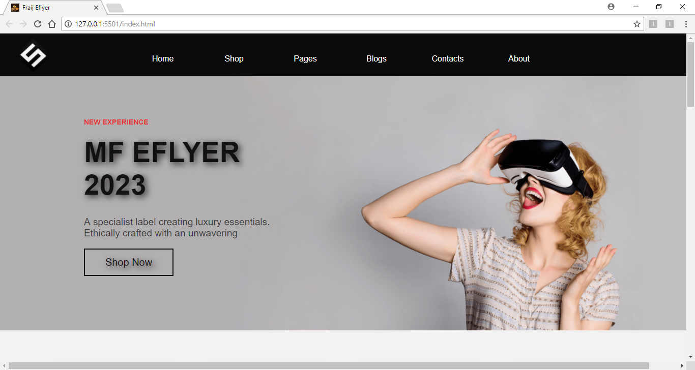
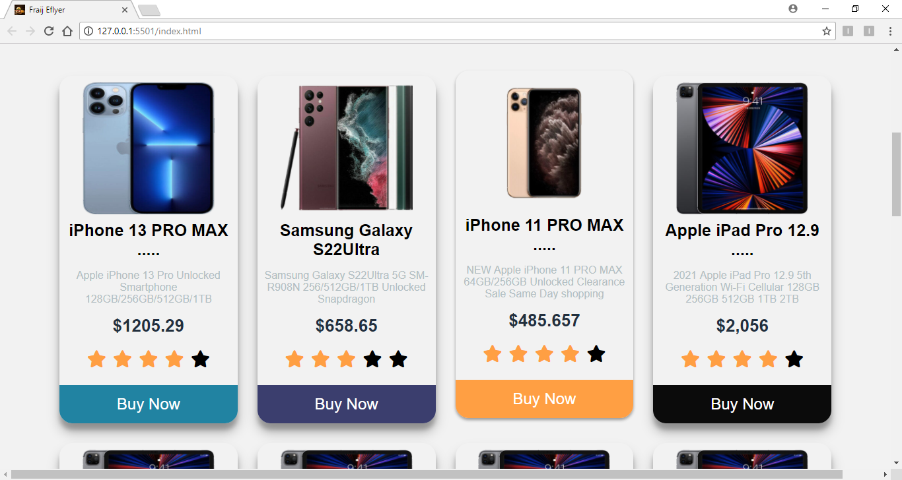
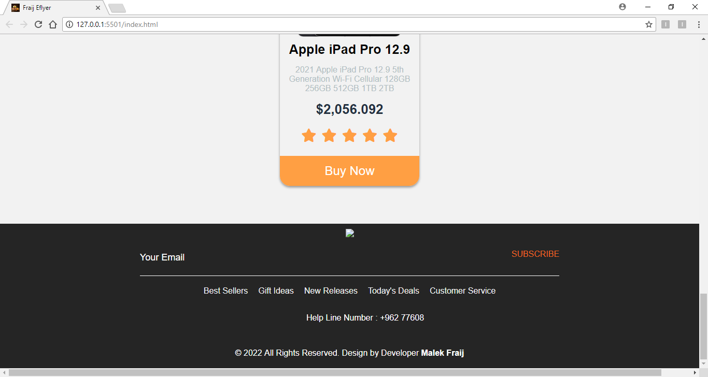

 
 <a href="https://github.com/MALEK-FRAIJ/ecommerce-web-page.git">
 
# MF Eflyer

It is a simple project to sell online phone devices and is a practical application of what I learned in the interface design using HTML, CSS, where an interface that simulates electronic design sites has been designed.

# MF Eflyer Logo

# list

 - [Introduction](#introduction)
 - [MF Eflyer Snapshot](#mf-eflyer-snapshot)
 - [About For MF Eflyer ](#about-for-mf-eflyer)

# Introduction 

It is a simple project to sell online phone devices and is a practical application of what I learned in the interface design using HTML, CSS, where an interface that simulates electronic design sites has been designed.

# MF Eflyer Snapshot

### ecommerce-web-page

### Header 

### Cart-Shopping

### Footer

# About For MF-Eflyer

You can improve that page by adding many features, for example, supporting many languages and adding night mode, as the interface is designed to be a responsive design, and you can add many responsive designs and add many services.

